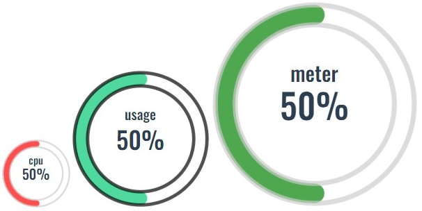

# :gear: Vue3 kaza-UI 
这么烂大街的东西就不上npm了:shit:



## :tada:安装 install
```
npx degit https://github.com/kazawan/kaza-vue-ui.git [./src/components/kaza-UI]
```

## :unlock:使用 
引入
```
import bar from './components/kazaUI/ProgressBar/kazaProgressBar.vue'
```
使用
```
<bar />
```

##:floppy_disk:Api

```
<bar width="200px" height="200px" :count='getCount' barColor="#02C874" boardColor="000" title="usage" titleFont_size="20px"
      titleTop="32%" />
```

|   |   api | 类型   | 默认值 | 
| :------: | :------: | :------:  | :------:   |
| 1    | width   | String   | '150px'  |
| 2    | height   | String   |'150px' |
| 3    | count   | Number   | 0 |
| 4    | barColor   | String   |'#1e4adb'|
| 5    | font_size   | String   |'35px' |
| 6    | boardColor   | String   |'#ccc'|
| 7    | title   | String   |' ' |
| 8    | titleTop   | String   |'35%' |
| 9    | titleFont_size   | String   |'10px'|

