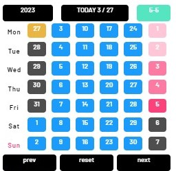

# :gear: Vue3 kaza-UI Calender




## :tada:安装 install
```
npm i kaza-ui
```

## :unlock:使用 
引入
```
import kazaUI from 'kaza-ui'
import 'kaza-ui/lib/style.css'
app.use(kazaUI)
```
使用
```
<kcals ref="calsbox" v-on:click-item="showmethedata" :data="todolists"></kcals>

<script setup>
const yymmdd = ref(`${date.getFullYear()}-${date.getMonth() + 1}-${date.getDate()}`)
// 定义一个函数，用于显示数据
const showmethedata = (data) => {
  yymmdd.value = data
}

const todolist = {
    '2023-3-26': {
    todo: [
      {
        id: 1,
        content: '调音',
        timestart :'19:00',
        workzone:'希尔顿酒店',
        tags:'调音',
        payment:'1000元',
        color:'#EAB543'
      },
      {
        id: 2,
        content: 'shop333ping',
        timestart:'22:00',
        workzone:'利和超市',
        tags:'私人',
        color:'#FC427B'
      },]
    }
}

</script>
```


## :floppy_disk:Api


| :clipboard: | :bar_chart: api | :pushpin:类型 | :pencil2:默认值 |    :ledger:备注    |
| :---------: | :-------------: | :-----------: | :-------------: | :----------------: |
|      1      |      data       |    Object     |   no default    | 可以传入todo待办件 |

数据结构
```
const todolist = {
    '2023-3-26': {
    todo: [
      {
        id: 1,
        content: '调音',
        timestart :'19:00',
        workzone:'希尔顿酒店',
        tags:'调音',
        payment:'1000元',
        color:'#EAB543'
      },
      {
        id: 2,
        content: 'shop333ping',
        timestart:'22:00',
        workzone:'利和超市',
        tags:'私人',
        color:'#FC427B'
      },]
    }
}
```